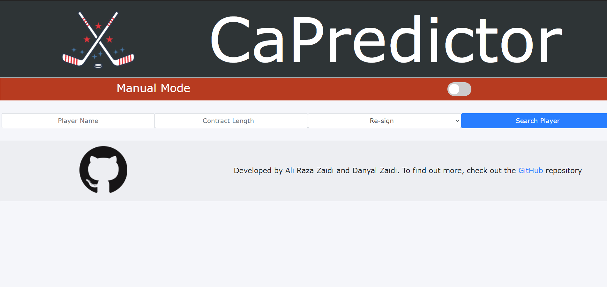

# CaPredictor

[Visit Me](https://capredictor.onrender.com)
- This might take a minute to boot up.

- A Flask App that runs a machine learning model for NHL Contracts and predicts a valuation for 
the player in question via the player's stats from the previous season
- [Visit CaPredictor here!](https://capredictor.herokuapp.com)
- Since I'm using a Free Heroku account, sometimes the app goes in hibernation and takes some 
time to open back up. Do not fret - Just reload and let it take its time!

## Motivation
- I have enjoyed hockey for a very long time and as a born-and-raised Canadian, hockey flows through my veins. 
  As an Avid Fan of the Toronto Maple Leafs, I was not impressed by some of the contracts being handed out by
  the team's management, and I wanted to use my skills to create a valuator for NHL players based on their stats.
- I enlisted the help of [my brother](https://github.com/DanyalZaidiPythonGithub), and together we collected data 
  for various NHL players to make models for contracts in the NHL

### Getting Started
- Visit the website at https://capredictor.herokuapp.com.
- When running a program of this sort on your own machine, you will need to have several python files installed, preferably
within a virtual environment and the required files can be seen in the `[Requirements File](requirements.txt)`
- Knowledge of Front-End development and Back-End development(through Flask) is required. Additionally, 
Knowledge of Python 3 is required

#### Installation
- I edited the app in both VScode and the Pycharm IDE, testing the program through my local machine
- To run the flask app, create a file named `app.py` and import the modules present in this [file](app.py)
- Add the following code under the file imports:
\
`app = Flask(__name__)
app.config['SQLALCHEMY_DATABASE_URI']='sqlite:///requests.db'
db = SQLAlchemy(app)`

- Make sure to add the following code at the bottom of the file:
\
`if __name__ == '__main__':
	app.run(debug=False)`
- Create a database in the working directory by running the following code in a terminal:
\
`python
from app import db
db.create_all()`

- To delete the database, run the following in a terminal:
\
`python
from app import db
db.delete_all()`

- This will ensure that the file can run. Add the following code to the app.py file underneath 
the app configuration and database setup:
\
`@app.route('/', methods=['POST', 'GET'])
def index():
	if request.method == 'POST':
		return redirect('/')
	else:
		return render_template('index.html')`
  
- For a much more in-depth explanation, visit this video by [freeCodeCamp.org](https://www.youtube.com/watch?v=Z1RJmh_OqeA)
- As for the models, My brother and I collected all the NHL Player data via [CapFriendly](https://www.capfriendly.com/), [HockeyDB](https://www.hockeydb.com/),
and [Hockey-Reference](https://www.hockey-reference.com/) and compiled them into several CSV files, present in the `Data` folder.
- The models were run through the `scikit-learn` library in python and the attributes deemed best to predict the contracts were selected and saved as .joblib files for later use
- The models used were Multiple Linear Regression Models, taking in up to 11 attributes and producing an output via Cap %
- We decided to use Cap % at signing of the contract instead of $ amount as the Cap changes year to year
- The [Predictor](Predictor/predictor.py) and [Interactions](Predictor/interactions.py) files were created and connect to each other
to help determine the contracts for each of the players
- The [Flask App](app.py) script had several methods added to it along with the required route decorators to ensure backend functionality. The user data was also processed and fed into the 
the `interaction.py` file to get the player valuations which would then be committed to the database
- The necessary HTML and CSS files (Although, Bootstrap 4 was used extensively in much of the program) were added, alongside some in-line JS to get the front-end working
	- Jinja 2 scripts were added inline as well to process the information received from the database and to ensure proper functionality of the code
- The app was then deployed to Heroku via GitHub

#### Test Run
- To Test the file, visit the [website](https://capredictor.herokuapp.com) or run it locally by running
the following code in your terminal:
\
`python app.py`

#### Deployment
- The program has been deployed on Heroku

### Authors
- The website was developed by myself, [Ali Raza Zaidi](https://github.com/AliRZ-02) and my brother, [Danyal Zaidi](https://github.com/DanyalZaidiPythonGithub)

### License
- This Software is licensed through the MIT License

### Learning Process 
- I learned quite a bit through this project, the likes of:
	- I learned how to create and deploy a flask app
	- I learned how to connect a front-end and back-end and how to use databases
	- I learned how to create data models in python using `scikit-learn`
	- I made myself more familiar with OOP Principles and their uses in Python
	- I became familiar with front-end frameworks like Bootstrap 4
	- I became familiar with Jinja2
	- I continued to get familiar with Git
	- I became more familiar with APIS and JSON Data
	- I became more familiar with automation through Python
	- I became more familiar with the data processing libraries in Python
	- I became more familiar with Heroku
	- I learned how to cohesively develop a full web application and deploy it

### Development
- This project is in its release phase now, although minor improvements are continually made

### Acknowledgements
- Visit the [Acknowledgements Page](acknowledgements.md)
